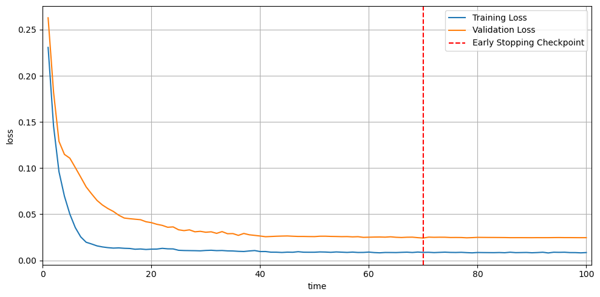
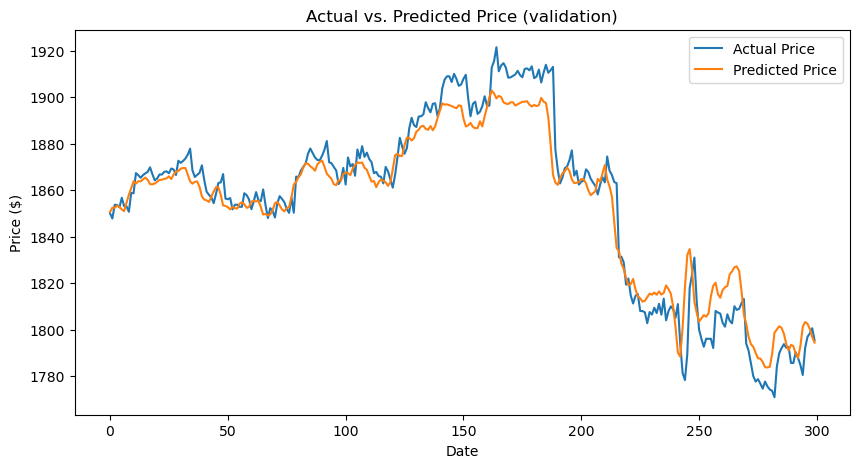
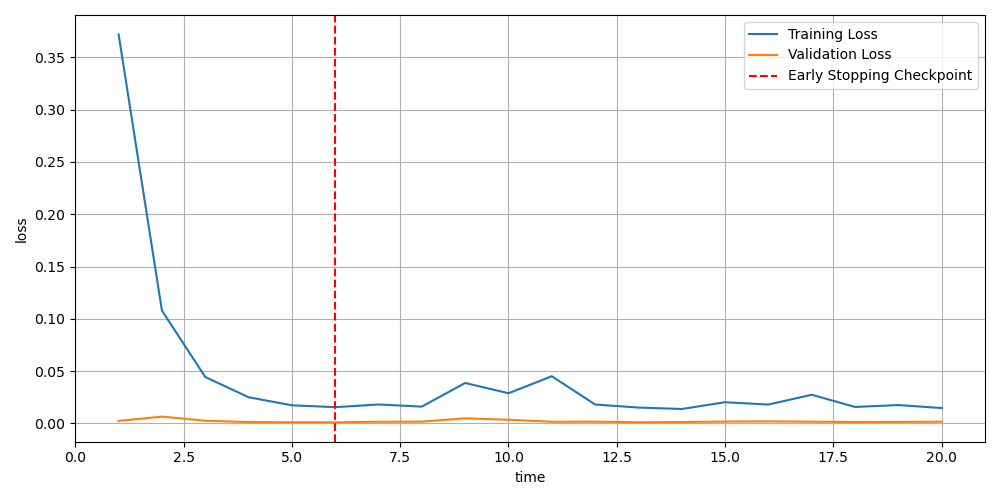
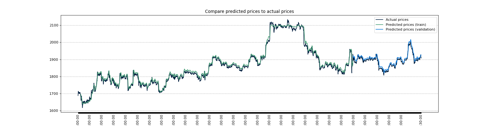

# ByBit-Market-Data-Download-and-Forecasting

      

This project aims to use LSTM networks to predict the next closing price of orders placed on the online cryptocurrency trading platform ByBit. Additionally, I have developed a client application that allows downloading the data that needs to be analyzed by the network.

Note that the model is built for exercise purposes only, as predicting cryptocurrency prices is a much more complex task. To achieve more accurate predictions, additional models like Natural Language Processing (NLP) techniques such as sentiment analysis, text classification, and topic modeling are required to analyze news and market information.

### Forecasting-model-1 results:

### Forecasting-model-2 results:

## Acknowledgments

Part of this project (forecasting-model-1) uses code with an MIT license. The full text of the license is available in licences/LICENSE file. The MIT-licensed code is derived from Bjarte Mehus Sunde https://github.com/Bjarten/early-stopping-pytorch, and is used in accordance with the terms of the MIT license.

Part of this project (forecasting-model-2) uses code with an Apache License 2.0. The full text of the license is available in licences/LICENSE file. The Apache License 2.0 licensed code is derived from Hong Jing (Jingles) https://github.com/jinglescode/time-series-forecasting-pytorch, and is used in accordance with the terms of the Apache License 2.0.

The HttpClient that allows you to download market data was created based on the examples provided by the API of the platform at https://github.com/bybit-exchange/api-usage-examples.
